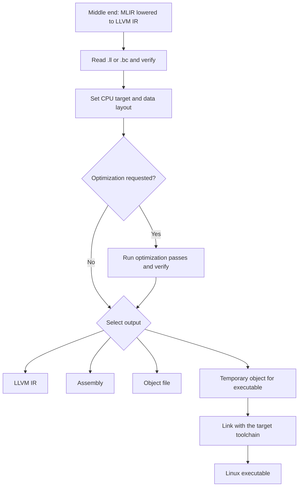

# LogicSilicon · LLVM Internship Projects

**From building LLVM IR to compiling for CPUs and running GPU kernels.**

C++ · LLVM · Compiler Frontends · NVIDIA PTX · RISC-V

**Faiq Abdullah**  
1 July 2026 – 16 September 2026

[Overview](#overview) · [Projects](#projects) · [Tiny Backend Pipeline](#tiny-backend-pipeline) · [Results](#results-and-deliverables) · [Future Work](#future-work)

---

## Overview

Four projects developed during my LLVM backend internship at **LogicSilicon**, under the supervision of **Irfan Hussein** and **Uzair Rehman**.

I started the internship with no prior LLVM experience. The first three projects helped me learn how to construct intermediate representation (IR), connect a language frontend to LLVM, and generate GPU code. The final project, **Tiny Backend**, applies that knowledge to the CPU code generation stage of a shared compiler pipeline.

The work follows **Brief 2: LLVM Backend**. The wider brief includes schedule-controlled optimization and build manifests. The current implementation provides the CPU compilation path; those additional features remain future work.

## Projects

| Project | Focus | Main output |
| :--- | :--- | :--- |
| [01 · LLVM Sandbox](#01--llvm-sandbox) | Build IR directly with the LLVM C++ API | LLVM IR, native object code, and a linked executable |
| [02 · Eva LLVM](#02--eva-llvm) | Connect a small language frontend to LLVM | Generated LLVM IR executed with `lli` |
| [03 · LLVM CUDA](#03--llvm-cuda) | Generate and run GPU kernels | NVIDIA PTX for vector addition and ReLU |
| [04 · Tiny Backend](#04--tiny-backend) | Optimize IR and compile for CPU targets | LLVM IR, assembly, object files, or executables |

## 01 · LLVM Sandbox

**Learn LLVM by constructing programs one instruction at a time.**

LLVM Sandbox is a collection of small C++ examples that build LLVM IR directly. The examples cover arithmetic, local variables, conditions, loops, function calls, and recursion, then extend the process to native object generation and linking.

### Implementation

- **Program structure:** `LLVMContext`, `Module`, and `IRBuilder<>` manage LLVM state, program contents, and instruction creation.
- **Functions and blocks:** `FunctionType`, `Function::Create`, `BasicBlock::Create`, and `SetInsertPoint` define functions and control where instructions are inserted.
- **Arithmetic and memory:** `CreateAdd`, `CreateSub`, and `CreateMul` build arithmetic operations; `CreateAlloca`, `CreateStore`, and `CreateLoad` represent local variables.
- **Control flow:** `CreateICmpSLT`, `CreateCondBr`, and `CreateBr` connect condition, body, and exit blocks. `CreatePHI` selects values from incoming paths and introduces static single assignment (SSA).
- **Calls and output:** `CreateCall` supports ordinary and recursive calls, including calls to an external `printf` declaration.

Function verification checks IR structure. The examples also save readable IR so that each Builder API operation can be compared with the instruction it produces.

For native output, the generator selects the host target, creates a generic `TargetMachine`, applies its data layout, and emits position-independent object code. A separate script links the object into an executable.

**Included:** commented C++ examples, generated IR and object files, build and link scripts, and an LLVM IR guide for beginners.

## 02 · Eva LLVM

**Connect source text, parsing, and LLVM IR generation.**

Eva LLVM is a small, tutorial-based frontend for a subset of the Eva language. It shows where LLVM fits within a compiler: a lexer recognizes tokens, a parser builds an expression tree, and the frontend translates supported expressions into IR.

### Implementation

- **Lexer:** regular-expression rules recognize numbers, quoted strings, and symbols. Whitespace and single-line or block comments are ignored.
- **Parser:** a BNF grammar describes Eva S-expressions, including atoms and nested parenthesized lists. `syntax-cli` generates the C++ LALR(1) parser.
- **Expression tree:** an `Exp` structure represents `NUMBER`, `STRING`, `SYMBOL`, and `LIST` nodes. Lists hold child expressions in a vector.
- **IR generation:** the frontend creates a `main` function and entry block, converts numbers to integer constants, and uses `CreateGlobalStringPtr` for strings.
- **Formatted output:** the frontend recognizes `printf` calls, generates their arguments, declares a variable-argument function type, and emits calls through `CreateCall`.

The driver writes generated IR to `out.ll`. The supplied script uses LLVM 14 tools and executes that IR with `lli-14`. CMake and Docker files provide additional build support.

> **Scope:** the grammar can represent more expressions than the code generator currently supports. The implemented subset covers number and string values and formatted output calls.

**Included:** grammar and parser files, frontend source, sample IR, build files, and beginner tutorial notes.

## 03 · LLVM CUDA

**Build GPU kernels with LLVM, emit PTX, and launch them through CUDA.**

This project implements two examples: **vector addition** and **ReLU**. The kernel generators construct LLVM IR, identify GPU entry points, and emit NVIDIA PTX. Separate host programs load and launch the kernels using the CUDA Driver API.

### Kernel construction

- Reads the thread index with the NVVM intrinsic `llvm.nvvm.read.ptx.sreg.tid.x`, declared through `getOrInsertFunction` and called with `CreateCall`.
- Extends the index with `CreateZExt` and checks input bounds with `CreateICmpULT` before accessing memory.
- Uses `CreateGEP` to calculate element addresses, followed by loads and stores.
- Uses `CreateAdd` for vector addition and `CreateFCmpOLT` with `CreateSelect` for ReLU.
- Marks kernel functions through `nvvm.annotations`, using the function reference, the string `kernel`, and an integer flag of `1`. The vector-add generator also sets `CallingConv::PTX_Kernel`.

### PTX generation and execution

The direct generator selects `nvptx64-nvidia-cuda`, creates a `TargetMachine` for `sm_86` with `+ptx71`, and sets the module triple and data layout. `addPassesToEmitFile` emits assembly, which is PTX text for the NVPTX target. The scripts also demonstrate saving LLVM IR and using `llc` to generate PTX externally.

The host program creates a CUDA context, loads PTX with `cuModuleLoadData`, finds the kernel with `cuModuleGetFunction`, allocates and transfers device data, and launches the kernel with `cuLaunchKernel`. It then synchronizes, copies results back, and releases resources.

> **Scope:** the examples use a thread index within one block. Larger workloads need block-index and block-size calculations for multi-block execution.

**Included:** two kernel generators, CUDA host programs, saved IR and PTX, build scripts, and documentation.

## 04 · Tiny Backend

**Turn lowered LLVM IR into output for x86-64 and RISC-V Linux.**

Tiny Backend is the final internship project and the closest match to the original brief. It uses **LLVM 22 and C++17** to implement the CPU backend stage of a shared compiler pipeline.

The middle-end partner lowers MLIR to LLVM IR. Tiny Backend starts at that boundary: it reads the IR, verifies it, configures the target, optionally optimizes the module, and emits the requested output.

### Tiny Backend Pipeline

### Input and target setup

- Accepts LLVM IR text (`.ll`) and bitcode (`.bc`) through `parseIRFile`.
- Checks input with `verifyModule` and protects existing output files.
- Registers the X86 and RISCV targets and sets the module triple and data layout.
- Configures RISC-V with `riscv64-unknown-linux-gnu`, `generic-rv64`, RV64GC features, and the `lp64d` ABI to match the Linux cross-toolchain.

### Optional optimizations

With `--optimize`, the backend registers analyses through `PassBuilder` and runs these function passes in order:

| Pass | Purpose |
| :--- | :--- |
| `mem2reg` | Promotes suitable stack variables to SSA values |
| `instcombine` | Simplifies instructions and folds constants |
| `reassociate` | Rearranges expressions to expose simplification opportunities |
| `GVN` | Reuses equivalent computed values |
| `simplify-cfg` | Simplifies branches and basic blocks |

### Code generation and linking

`TargetMachine` generates assembly or object code. Executable mode links a temporary object using `cc` for x86-64 or `riscv64-linux-gnu-gcc` for RISC-V. Linking uses position-independent code, `-pie`, and `-lm` for the math library. The temporary object is removed after linking.

> **Input contract:** Tiny Backend consumes LLVM IR, rather than MLIR directly. The input must match the destination ABI and target assumptions; changing the target triple alone does not make arbitrary IR portable.

**Included:** modular source, CMake and shell scripts, Python integration tests, sample IR, seven focused guides, and a presentation.

## Results and Deliverables

- **Four documented projects** covering IR construction, frontend integration, GPU code generation, and CPU backend development.
- **Two CPU targets** in Tiny Backend: x86-64 and RISC-V Linux.
- **Two GPU examples:** vector addition and ReLU.
- **33 passing integration scenarios** recorded in the saved Tiny Backend test log.
- **RISC-V execution tested using QEMU with a Linux runtime.**
- **Reusable learning material:** commented examples, guides, scripts, tests, and a backend presentation for future interns.

These results establish a working compilation path and a base for further development. Runtime speedups are a future measurement task.

## Build and Run

Each project has its own build scripts and documentation. Follow the instructions supplied with the project you want to explore; the projects use different LLVM versions and target requirements.

| Project | Build and runtime notes |
| :--- | :--- |
| LLVM Sandbox | LLVM C++ development tools and a native linker |
| Eva LLVM | Supplied scripts use LLVM 14 and `lli-14`; CMake and Docker support are included |
| LLVM CUDA | LLVM with NVPTX support; a compatible NVIDIA GPU and CUDA environment are needed to execute kernels |
| Tiny Backend | LLVM 22, C++17, and a native linker; the RISC-V path uses `riscv64-linux-gnu-gcc`, with QEMU and a Linux runtime for emulated testing |

For a guided reading order, start with **LLVM Sandbox**, continue through **Eva LLVM** and **LLVM CUDA**, then explore **Tiny Backend**.

## Future Work

The next steps focus on completing more of the original backend brief:

- **Schedule interface:** define how the middle end passes loop schedules and optimization requests to the backend.
- **Directive profiles:** translate supported requests into LLVM loop metadata, including `llvm.loop.unroll.count` and `llvm.loop.vectorize.enable`.
- **Transformation checks:** add the required loop passes and use optimization remarks to confirm whether requested transformations were applied.
- **Build manifests:** record targets, ABI settings, entry points, compiler flags, output files, and required libraries.
- **Broader integration tests:** use representative middle-end kernels, compare against reference implementations, and automate QEMU execution.
- **Performance evaluation:** compare optimized and unoptimized workloads for correctness, runtime, and code size, with hardware testing when available.

---

**Developed by Faiq Abdullah during the LogicSilicon LLVM Backend Internship.**  
Supervisors: Irfan Hussein and Uzair Rehman.
